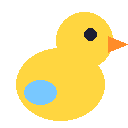
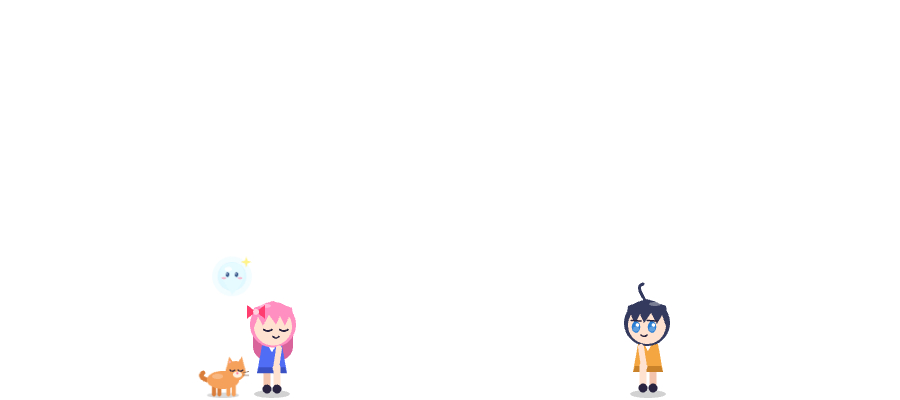
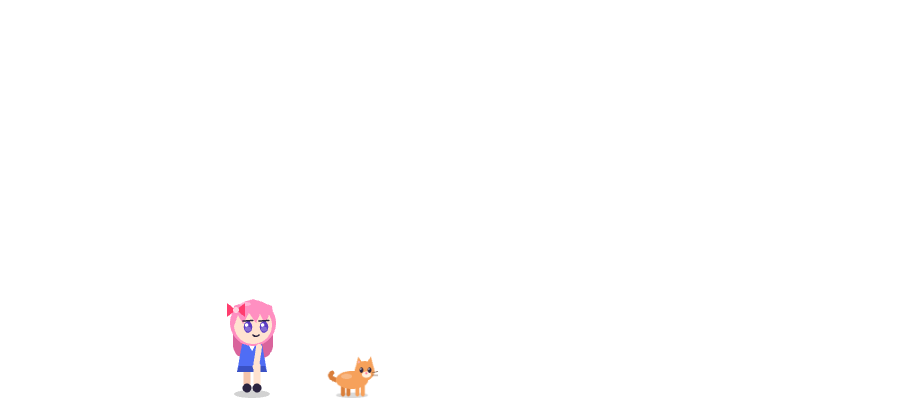
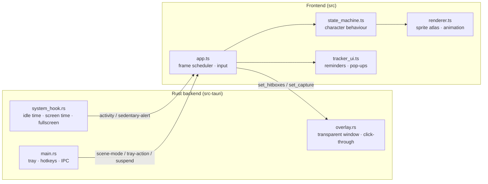

<div align="center">



# Sip Duck

**An anime desktop companion that walks on your taskbar, reminds you to drink water and makes you stand up when you've been sitting too long.**

[](https://github.com/gyuv16/Sip-Duck/actions/workflows/build.yml)


[Download](#-download) · [Features](#-features) · [Controls](#-controls) · [How it stays light](#-how-it-stays-light) · [Build from source](#-build-from-source)

<br />



<sub><i>Couple + Pet mode — the characters live on a transparent, click-through layer above your desktop.</i></sub>

</div>

---

## ✨ Features

<table>
<tr>
<td width="50%" valign="top">

### 💧 Hydration reminders
Every 45 minutes (configurable) your buddy **collapses, dizzy from thirst**.
A small pop-up offers **I drank a glass** or **Snooze 10 min**. Logging a glass plays a
drinking animation with a **water splash**, and your daily count and goal are tracked.

</td>
<td width="50%" valign="top">

### 🧘 Sitting-too-long alerts
Real keyboard/mouse idle time is read from the OS. After **45 minutes of continuous
sitting**, the characters run to the middle of your screen, **blow a whistle** and hold a
**“STAND UP & STRETCH!”** banner. Three minutes away from the desk resets the timer.

</td>
</tr>
<tr>
<td valign="top">

### 🎭 Four scene modes
| Mode | Cast |
| --- | --- |
| Solo | Hina |
| Human + Pet | Hina + cat |
| Couple | Hina + Ren |
| Couple + Pet | Hina, Ren, cat and a floating spirit |

Couples walk to each other, wave across the screen and share hearts. Pets follow their owner.

</td>
<td valign="top">

### 🖱️ Lives on your desktop
- Walks on the **top edge of your taskbar**
- **Drag and throw** characters — they bounce off screen edges
- **Click** to get a wave back
- Clicks everywhere else **pass through** to your apps
- **Falls asleep** when you're away, **hides itself** during fullscreen games and videos
- Multi-monitor: move it to any screen from the tray

</td>
</tr>
</table>

<div align="center">

<br /><sub><i>Human + Pet mode</i></sub>
</div>

---

## 📥 Download

Grab the installer for your system from the **[Releases page](https://github.com/gyuv16/Sip-Duck/releases)**:

| System | File |
| --- | --- |
| Windows 10/11 | `Sip Duck_x.y.z_x64-setup.exe` |
| macOS | `Sip Duck_x.y.z_*.dmg` |
| Linux | `sip-duck_x.y.z_amd64.AppImage` |

> [!NOTE]
> The builds are not code-signed yet. On Windows click **More info → Run anyway**; on macOS
> right-click the app → **Open** the first time.

Every CI run also attaches the installers as artifacts (**Actions** tab → latest run → **Artifacts**).

---

## 🎮 Controls

| Action | How |
| --- | --- |
| Drag & throw a character | Click and drag it |
| Make a character react | Click it (re-opens a dismissed reminder) |
| Make everything click-through | <kbd>Ctrl</kbd> + <kbd>Shift</kbd> + <kbd>D</kbd> |
| Hydration reminder now | <kbd>Ctrl</kbd> + <kbd>Shift</kbd> + <kbd>H</kbd> |
| Pause / resume | Left-click the tray icon |
| Scene mode, stretch now, next monitor, quit | Right-click the tray icon |

---

## ⚡ How it stays light

No Electron, no bundled Chromium, no Python. The app uses the operating system's own webview through Tauri.

| Target | Design |
| --- | --- |
| Idle CPU < 0.5 % | Drawing **stops completely (0 FPS)** when nothing moves; idle breathing runs at 4–12 FPS using timers instead of a 60 Hz loop |
| Active CPU < 3 % | 60 FPS only while something moves, is dragged or hovered; frames where nothing changed skip the GPU |
| RAM < 20 MB (app side) | All character frames drawn once into **one shared texture**; old textures freed on every scene switch |
| Installer < 15 MB | Rust release profile: `lto`, `opt-level = "z"`, `codegen-units = 1`, `panic = "abort"`, `strip` |

> [!IMPORTANT]
> These are design targets. They have not been measured on real hardware yet.



---

## 🛠️ Build from source

**Requirements:** Rust ≥ 1.77, Node ≥ 20, and the [Tauri v2 system prerequisites](https://v2.tauri.app/start/prerequisites/).

```bash
git clone https://github.com/gyuv16/Sip-Duck.git
cd Sip-Duck
npm install && npm ci --prefix src   # Tauri CLI + frontend deps
npm run dev        # run the app with hot reload
npm run build      # build the installer → src-tauri/target/release/bundle/
```

Preview the characters in a normal browser (desktop features turned off): `npm --prefix src run dev` → http://localhost:1420

<details>
<summary><b>📁 Project structure</b></summary>

```
├── package.json            # Tauri CLI wrapper
├── .github/workflows/      # CI: build installers on Windows/macOS/Linux, release on tags
├── src-tauri/              # Rust backend
│   ├── Cargo.toml          # size-optimised release profile
│   ├── tauri.conf.json     # transparent, frameless, always-on-top window
│   └── src/
│       ├── main.rs         # setup, tray, global hotkeys, IPC commands
│       ├── system_hook.rs  # idle + screen-time tracking, fullscreen detection
│       └── overlay.rs      # window sizing, multi-monitor, click-through engine
└── src/                    # frontend
    ├── app.ts              # PixiJS engine, frame scheduler, IPC
    ├── state_machine.ts    # character state machines + scene director
    ├── renderer.ts         # sprite atlas, animation, particles
    └── tracker_ui.ts       # hydration tracker + reminder pop-ups
```
</details>

<details>
<summary><b>🎨 Use your own character art</b></summary>

Put a TexturePacker/Aseprite JSON + PNG/AVIF sprite sheet at
`src/public/assets/<hero|partner|cat|spirit>.json`. Name the animations
`idle, walk, drink, stretch, whistle, dragged, fall, collapse, sleep, wave`, with frames
anchored bottom-centre (96×128 for people, 72×64 for pets). It replaces the built-in art automatically.
</details>

<details>
<summary><b>🚀 Publishing a release</b></summary>

```bash
git tag v0.1.0
git push origin v0.1.0
```

CI builds all three installers and publishes them on the Releases page with generated notes.
Or without a local tag: **Actions → Build → Run workflow**, enter `v0.1.0` as *release_tag*.
</details>

<details>
<summary><b>🐧 Platform notes</b></summary>

- **Idle tracking** works on Windows and macOS. Linux has no portable idle API, so the sitting timer counts from start-up / your last confirmed break.
- **Fullscreen auto-hide** is Windows only (macOS fullscreen apps use their own Space).
- **Wayland** doesn't expose the cursor position, so characters can't be dragged there; the overlay stays click-through.
- Hydration counts reset at local midnight; screen time today resets at UTC midnight.
</details>

---

<div align="center">
<sub>Made with 💧 and Tauri · Stay hydrated, stretch often.</sub>
</div>
